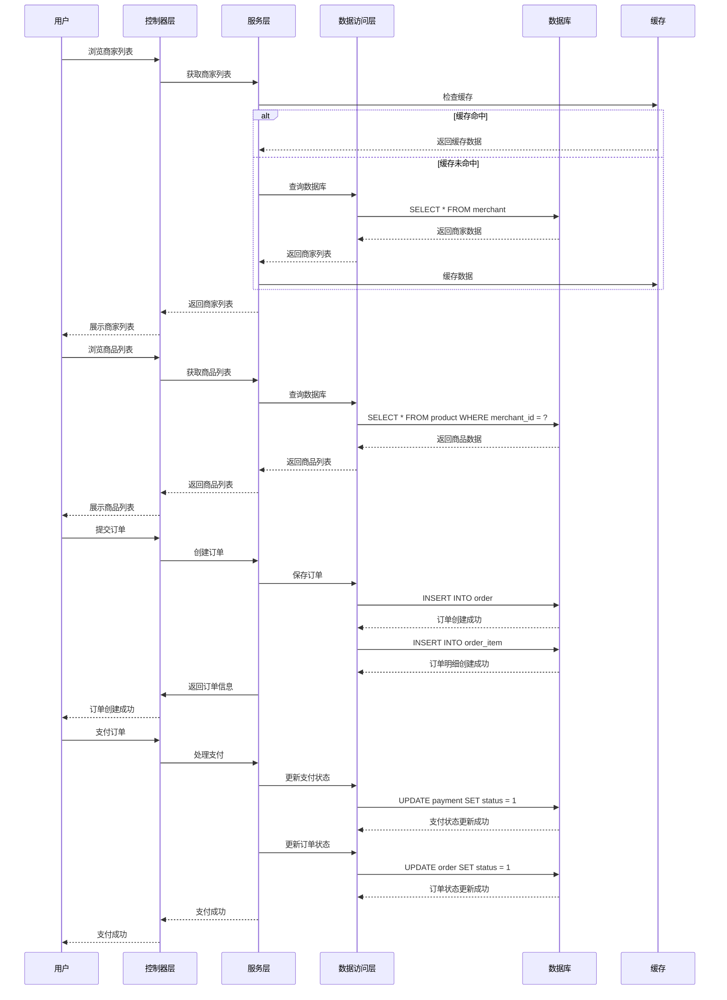

# 校园点餐管理系统开发文档

## 1. 项目概述

### 1.1 项目背景
校园点餐管理系统旨在为高校师生提供便捷的线上点餐服务，解决传统食堂排队时间长、点餐效率低等问题，同时为食堂商家提供基本的订单管理能力。

### 1.2 项目目标
- 提升师生点餐体验，减少排队等待时间
- 优化食堂运营效率，降低人工成本
- 实现基本的线上点餐和订单管理功能
- 支持单一食堂的档口管理

### 1.3 技术栈
- **后端**：Spring Boot 3.3.x + Java 17
- **数据库**：MySQL 8.0
- **认证**：Sa-Token 1.34.0
- **ORM**：MyBatis-Flex 1.11.5
- **缓存**：Redis 7.0（可选）
- **前端**：React 18 + TypeScript + TailwindCSS

## 2. 系统架构设计

### 2.1 架构模式
采用单体应用架构（Monolith），包含以下层次：
- **控制器层（Controller）**：处理HTTP请求，参数验证，返回响应
- **服务层（Service）**：业务逻辑处理
- **数据访问层（DAO）**：数据库操作
- **实体层（Entity）**：数据模型定义
- **工具层（Util）**：通用工具类
- **配置层（Config）**：系统配置

### 2.2 核心流程图

#### 用户点餐流程


## 3. 目录结构设计

### 3.1 后端目录结构
```
backend/
├── src/
│   ├── main/
│   │   ├── java/com/xingchen/backend/
│   │   │   ├── controller/         # 控制器层
│   │   │   │   ├── user/           # 用户相关接口
│   │   │   │   ├── merchant/       # 商家相关接口
│   │   │   │   ├── product/        # 商品相关接口
│   │   │   │   ├── order/          # 订单相关接口
│   │   │   │   └── admin/          # 管理员相关接口
│   │   │   ├── service/            # 服务层
│   │   │   │   ├── impl/           # 服务实现
│   │   │   │   └── dto/            # 数据传输对象
│   │   │   ├── mapper/             # 数据访问层
│   │   │   ├── entity/             # 实体层
│   │   │   ├── config/             # 配置层
│   │   │   │   ├── security/       # 安全配置
│   │   │   │   └── mybatis/        # MyBatis配置
│   │   │   ├── util/               # 工具类
│   │   │   │   ├── constant/       # 常量定义
│   │   │   │   ├── exception/      # 异常处理
│   │   │   │   └── validator/      # 数据验证
│   │   │   └── BackendApplication.java  # 应用入口
│   │   └── resources/
│   │       ├── application.yaml    # 主配置文件
│   │       ├── application-dev.yaml # 开发环境配置
│   │       ├── application-prod.yaml # 生产环境配置
│   │       └── db/                 # 数据库脚本
│   └── test/                       # 测试代码
├── pom.xml                         # Maven配置
└── mvnw.cmd                        # Maven Wrapper
```

### 3.2 前端目录结构
```
front/app/
├── public/                         # 静态资源
├── src/
│   ├── assets/                     # 资源文件
│   ├── components/                 # 公共组件
│   │   ├── common/                 # 通用组件
│   │   ├── layout/                 # 布局组件
│   │   └── ui/                     # UI组件
│   ├── pages/                      # 页面组件
│   │   ├── user/                   # 用户端页面
│   │   ├── merchant/               # 商家端页面
│   │   └── admin/                  # 管理端页面
│   ├── router/                     # 路由配置
│   ├── stores/                     # 状态管理(Zustand)
│   ├── services/                   # API调用
│   ├── hooks/                      # 自定义Hooks
│   ├── types/                      # TypeScript类型
│   ├── utils/                      # 工具类
│   ├── App.tsx                     # 根组件
│   └── main.tsx                    # 入口文件
├── package.json                    # 依赖配置
└── vite.config.ts                  # Vite配置
```

## 4. 核心功能实现方案

### 4.1 用户认证模块

#### 4.1.1 功能描述
- 手机号注册/登录
- 密码登录
- 个人信息管理

#### 4.1.2 技术实现
- 使用Sa-Token实现Token认证
- 手机号验证码登录
- 密码BCrypt加密存储
- Redis存储验证码和Token

#### 4.1.3 API设计
| API路径 | 方法 | 功能 | 权限 |
|---------|------|------|------|
| `/api/auth/register` | POST | 用户注册 | 无 |
| `/api/auth/login` | POST | 用户登录 | 无 |
| `/api/auth/logout` | POST | 退出登录 | 登录用户 |
| `/api/auth/send-sms` | POST | 发送验证码 | 无 |
| `/api/auth/sms-login` | POST | 短信登录 | 无 |
| `/api/auth/check-phone` | GET | 检查手机号 | 无 |
| `/api/user/profile` | GET | 获取个人信息 | 登录用户 |
| `/api/user/profile` | PUT | 更新个人信息 | 登录用户 |
| `/api/user/change-password` | POST | 修改密码 | 登录用户 |

### 4.2 商家管理模块

#### 4.2.1 功能描述
- 商家列表展示
- 商家详情查看
- 商家分类管理
- 营业时间管理

#### 4.2.2 技术实现
- 分页查询商家列表
- 缓存热门商家
- 营业时间CRUD操作

#### 4.2.3 API设计
| API路径 | 方法 | 功能 | 权限 |
|---------|------|------|------|
| `/api/merchant/list` | GET | 获取商家列表 | 无 |
| `/api/merchant/detail/{id}` | GET | 获取商家详情 | 无 |
| `/api/merchant/category/list` | GET | 获取商家分类 | 无 |
| `/api/merchant/search` | GET | 搜索商家 | 无 |
| `/api/merchant/hot` | GET | 获取热门商家 | 无 |
| `/api/merchant/nearby` | GET | 获取附近商家 | 无 |
| `/api/merchant` | POST | 创建商家 | 登录用户 |
| `/api/merchant/{id}` | PUT | 更新商家 | 登录用户 |
| `/api/merchant/{id}` | DELETE | 删除商家 | 登录用户 |
| `/api/merchant/{id}/status` | PUT | 更新商家状态 | 登录用户 |

#### 4.2.4 商家端管理API
| API路径 | 方法 | 功能 | 权限 |
|---------|------|------|------|
| `/api/merchant/manage/info` | GET | 获取当前商家信息 | 商家 |
| `/api/merchant/manage/info` | PUT | 更新商家信息 | 商家 |
| `/api/merchant/manage/business-hours` | GET | 获取营业时间 | 商家 |
| `/api/merchant/manage/business-hours/{dayOfWeek}` | PUT | 更新营业时间 | 商家 |
| `/api/merchant/manage/status` | GET | 获取店铺状态 | 商家 |
| `/api/merchant/manage/status/toggle` | POST | 切换营业状态 | 商家 |
| `/api/merchant/manage/statistics` | GET | 获取店铺统计 | 商家 |
| `/api/merchant/business-hours` | GET | 获取营业时间(公开) | 无 |
| `/api/merchant/business-hours` | POST | 设置营业时间 | 商家 |
| `/api/merchant/business-hours/single` | POST | 创建营业时间 | 商家 |
| `/api/merchant/business-hours/{id}` | PUT | 更新营业时间 | 商家 |
| `/api/merchant/business-hours/{id}` | DELETE | 删除营业时间 | 商家 |
| `/api/merchant/business-hours/check` | GET | 检查营业状态 | 无 |
| `/api/merchant/business-hours/week/{merchantId}` | GET | 获取周营业时间 | 无 |

### 4.3 商品管理模块

#### 4.3.1 功能描述
- 商品分类管理
- 商品CRUD操作
- 商品库存管理

#### 4.3.2 技术实现
- 商品分类树形结构
- 商品图片上传
- 库存实时更新

#### 4.3.3 公开API设计
| API路径 | 方法 | 功能 | 权限 |
|---------|------|------|------|
| `/api/product/list` | GET | 获取商品列表 | 无 |
| `/api/product/detail/{id}` | GET | 获取商品详情 | 无 |
| `/api/product/merchant/{merchantId}` | GET | 获取商家商品 | 无 |
| `/api/product/search` | GET | 搜索商品 | 无 |
| `/api/product/hot` | GET | 获取热门商品 | 无 |
| `/api/product/category/list` | GET | 获取商品分类 | 无 |
| `/api/product/category/tree` | GET | 获取分类树 | 无 |
| `/api/product/category/{id}` | GET | 获取分类详情 | 无 |
| `/api/product/category/sub` | GET | 获取子分类 | 无 |
| `/api/product/category/root` | GET | 获取根分类 | 无 |
| `/api/product/category/{id}/path` | GET | 获取分类路径 | 无 |

#### 4.3.4 商家端商品管理API
| API路径 | 方法 | 功能 | 权限 |
|---------|------|------|------|
| `/api/merchant/product/create` | POST | 创建商品 | 商家 |
| `/api/merchant/product/update/{productId}` | PUT | 更新商品 | 商家 |
| `/api/merchant/product/delete/{productId}` | DELETE | 删除商品 | 商家 |
| `/api/merchant/product/on-shelf/{productId}` | POST | 商品上架 | 商家 |
| `/api/merchant/product/off-shelf/{productId}` | POST | 商品下架 | 商家 |
| `/api/merchant/product/list` | GET | 获取商品列表 | 商家 |
| `/api/merchant/product/detail/{productId}` | GET | 获取商品详情 | 商家 |
| `/api/merchant/product/batch-update-stock` | POST | 批量更新库存 | 商家 |

### 4.4 订单管理模块

#### 4.4.1 功能描述
- 订单创建
- 订单状态更新
- 订单查询
- 订单统计

#### 4.4.2 技术实现
- 订单号生成策略
- 订单状态流转
- 订单消息通知

#### 4.4.3 用户端订单API
| API路径 | 方法 | 功能 | 权限 |
|---------|------|------|------|
| `/api/order` | POST | 创建订单 | 登录用户 |
| `/api/order/list` | GET | 获取订单列表 | 登录用户 |
| `/api/order/{orderId}` | GET | 获取订单详情 | 登录用户 |
| `/api/order/{orderId}/cancel` | POST | 取消订单 | 登录用户 |
| `/api/order/{orderId}/confirm-pickup` | POST | 确认取餐 | 登录用户 |

#### 4.4.4 商家端订单API
| API路径 | 方法 | 功能 | 权限 |
|---------|------|------|------|
| `/api/merchant/orders` | GET | 获取商家订单列表 | 商家 |
| `/api/merchant/orders/{orderId}` | GET | 获取订单详情 | 商家 |
| `/api/merchant/orders/{orderId}/accept` | POST | 接单 | 商家 |
| `/api/merchant/orders/{orderId}/reject` | POST | 拒单 | 商家 |
| `/api/merchant/orders/{orderId}/complete` | POST | 完成订单 | 商家 |
| `/api/merchant/orders/pending-count` | GET | 获取待处理数量 | 商家 |

### 4.5 支付模块

#### 4.5.1 功能描述
- 支付下单
- 支付回调
- 支付状态查询
- 模拟支付（测试用）

#### 4.5.2 技术实现
- 支付宝沙箱支付
- 支付签名验证
- 异步回调处理

#### 4.5.3 API设计
| API路径 | 方法 | 功能 | 权限 |
|---------|------|------|------|
| `/api/payment/create` | POST | 创建支付 | 登录用户 |
| `/api/payment/status/{orderNo}` | GET | 查询支付状态 | 登录用户 |
| `/api/payment/record/{orderNo}` | GET | 获取支付记录 | 登录用户 |
| `/api/payment/alipay/notify` | POST | 支付宝回调 | 无 |
| `/api/payment/simulate/{orderNo}` | POST | 模拟支付成功 | 登录用户 |

### 4.6 收货地址模块

#### 4.6.1 功能描述
- 地址CRUD操作
- 默认地址设置

#### 4.6.2 API设计
| API路径 | 方法 | 功能 | 权限 |
|---------|------|------|------|
| `/api/address/create` | POST | 创建地址 | 登录用户 |
| `/api/address/update/{addressId}` | PUT | 更新地址 | 登录用户 |
| `/api/address/delete/{addressId}` | DELETE | 删除地址 | 登录用户 |
| `/api/address/list` | GET | 获取地址列表 | 登录用户 |
| `/api/address/detail/{addressId}` | GET | 获取地址详情 | 登录用户 |
| `/api/address/default` | GET | 获取默认地址 | 登录用户 |

### 4.7 文件管理模块

#### 4.7.1 功能描述
- 文件上传
- 文件下载
- 文件预览

#### 4.7.2 API设计
| API路径 | 方法 | 功能 | 权限 |
|---------|------|------|------|
| `/api/file/upload` | POST | 上传文件 | 登录用户 |
| `/api/file/upload/batch` | POST | 批量上传 | 登录用户 |
| `/api/file/download/{fileId}` | GET | 下载文件 | 无 |
| `/api/file/view/**` | GET | 预览文件 | 无 |

### 4.8 消息通知模块

#### 4.8.1 功能描述
- 消息列表
- 未读数量
- 标记已读

#### 4.8.2 API设计
| API路径 | 方法 | 功能 | 权限 |
|---------|------|------|------|
| `/api/notification/list` | GET | 获取消息列表 | 登录用户 |
| `/api/notification/unread-count` | GET | 获取未读数量 | 登录用户 |
| `/api/notification/read/{notificationId}` | POST | 标记已读 | 登录用户 |
| `/api/notification/read-all` | POST | 全部已读 | 登录用户 |
| `/api/notification/delete/{notificationId}` | DELETE | 删除消息 | 登录用户 |

### 4.9 评价模块

#### 4.9.1 功能描述
- 订单评价
- 评价列表
- 商家回复

#### 4.9.2 API设计
| API路径 | 方法 | 功能 | 权限 |
|---------|------|------|------|
| `/api/review/create` | POST | 创建评价 | 登录用户 |
| `/api/review/list` | GET | 获取评价列表 | 无 |
| `/api/review/{id}` | GET | 获取评价详情 | 无 |
| `/api/review/order/{orderId}` | GET | 获取订单评价 | 登录用户 |
| `/api/review/{id}/reply` | POST | 商家回复 | 商家 |

### 4.10 商家统计模块

#### 4.10.1 功能描述
- 营业统计
- 营收趋势
- 热销菜品

#### 4.10.2 API设计
| API路径 | 方法 | 功能 | 权限 |
|---------|------|------|------|
| `/api/merchant/statistics` | GET | 获取统计数据 | 商家 |
| `/api/merchant/statistics/revenue` | GET | 获取营收趋势 | 商家 |
| `/api/merchant/statistics/top-dishes` | GET | 获取热销菜品 | 商家 |

### 4.11 管理员模块

#### 4.11.1 功能描述
- 用户管理
- 订单监控
- 系统配置
- 数据统计

#### 4.11.2 API设计
| API路径 | 方法 | 功能 | 权限 |
|---------|------|------|------|
| `/api/admin/users` | GET | 获取用户列表 | 管理员 |
| `/api/admin/users/{userId}` | GET | 获取用户详情 | 管理员 |
| `/api/admin/users/{userId}/status` | PUT | 更新用户状态 | 管理员 |
| `/api/admin/users/{userId}` | DELETE | 删除用户 | 管理员 |
| `/api/admin/orders` | GET | 获取所有订单 | 管理员 |
| `/api/admin/orders/{orderId}` | GET | 获取订单详情 | 管理员 |
| `/api/admin/orders/{orderId}/cancel` | POST | 取消订单 | 管理员 |
| `/api/admin/orders/statistics` | GET | 获取订单统计 | 管理员 |
| `/api/admin/dashboard` | GET | 获取仪表盘数据 | 管理员 |
| `/api/admin/scheduler/status` | GET | 获取定时任务状态 | 管理员 |

## 5. 前端路由设计

### 5.1 用户端路由
| 路由路径 | 页面组件 | 功能描述 |
|----------|----------|----------|
| `/` | Home | 首页 |
| `/stores` | Stores | 商家列表 |
| `/store/:id` | StoreDetail | 商家详情 |
| `/cart` | Cart | 购物车 |
| `/checkout` | Checkout | 结算页 |
| `/orders` | Orders | 订单列表 |
| `/order/:id` | OrderDetail | 订单详情 |
| `/profile` | Profile | 个人中心 |
| `/login` | Login | 登录页 |
| `/register` | Register | 注册页 |

### 5.2 商家端路由（待实现）
| 路由路径 | 页面组件 | 功能描述 |
|----------|----------|----------|
| `/merchant` | MerchantHome | 商家首页 |
| `/merchant/orders` | MerchantOrders | 订单管理 |
| `/merchant/products` | MerchantProducts | 商品管理 |
| `/merchant/statistics` | MerchantStatistics | 数据统计 |
| `/merchant/settings` | MerchantSettings | 店铺设置 |

### 5.3 管理端路由（待实现）
| 路由路径 | 页面组件 | 功能描述 |
|----------|----------|----------|
| `/admin` | AdminHome | 管理首页 |
| `/admin/users` | AdminUsers | 用户管理 |
| `/admin/merchants` | AdminMerchants | 商家管理 |
| `/admin/orders` | AdminOrders | 订单管理 |
| `/admin/statistics` | AdminStatistics | 数据统计 |
| `/admin/settings` | AdminSettings | 系统设置 |

## 6. 数据库操作设计

### 6.1 核心数据模型

#### 用户表 (user)
| 字段名 | 数据类型 | 描述 |
|--------|----------|------|
| id | BIGINT UNSIGNED | 用户ID |
| username | VARCHAR(50) | 用户名 |
| nickname | VARCHAR(50) | 昵称 |
| phone | VARCHAR(20) | 手机号 |
| password | VARCHAR(100) | 密码(BCrypt加密) |
| avatar | VARCHAR(255) | 头像URL |
| gender | TINYINT | 性别 |
| user_type | TINYINT | 用户类型(0-用户,1-商家,2-管理员) |
| status | TINYINT | 状态 |
| is_deleted | TINYINT | 逻辑删除 |

#### 商家表 (merchant)
| 字段名 | 数据类型 | 描述 |
|--------|----------|------|
| id | BIGINT UNSIGNED | 商家ID |
| name | VARCHAR(100) | 商家名称 |
| logo | VARCHAR(255) | 商家Logo |
| category_id | INT | 商家分类ID |
| description | VARCHAR(500) | 商家简介 |
| status | TINYINT | 状态 |
| is_deleted | TINYINT | 逻辑删除 |

#### 商品表 (product)
| 字段名 | 数据类型 | 描述 |
|--------|----------|------|
| id | BIGINT UNSIGNED | 商品ID |
| merchant_id | BIGINT UNSIGNED | 商家ID |
| category_id | INT | 分类ID |
| name | VARCHAR(100) | 商品名称 |
| price | DECIMAL(10,2) | 价格 |
| stock | INT | 库存 |
| status | TINYINT | 状态 |
| is_deleted | TINYINT | 逻辑删除 |

#### 订单表 (order)
| 字段名 | 数据类型 | 描述 |
|--------|----------|------|
| id | BIGINT UNSIGNED | 订单ID |
| order_no | VARCHAR(32) | 订单号 |
| user_id | BIGINT UNSIGNED | 用户ID |
| merchant_id | BIGINT UNSIGNED | 商家ID |
| total_amount | DECIMAL(10,2) | 订单总金额 |
| actual_amount | DECIMAL(10,2) | 实付金额 |
| status | TINYINT | 订单状态 |
| pay_status | TINYINT | 支付状态 |
| is_deleted | TINYINT | 逻辑删除 |

### 6.2 核心SQL语句

#### 用户登录
```sql
SELECT * FROM user WHERE phone = ? AND is_deleted = 0
```

#### 商家列表查询
```sql
SELECT m.*, mc.name as category_name 
FROM merchant m 
LEFT JOIN merchant_category mc ON m.category_id = mc.id 
WHERE m.status = 1 AND m.is_deleted = 0 
ORDER BY m.sort_order DESC, m.sales_volume DESC 
LIMIT ? OFFSET ?
```

#### 商品列表查询
```sql
SELECT p.*, pc.name as category_name 
FROM product p 
LEFT JOIN product_category pc ON p.category_id = pc.id 
WHERE p.merchant_id = ? AND p.status = 1 AND p.is_deleted = 0 
ORDER BY p.sort_order DESC 
LIMIT ? OFFSET ?
```

#### 订单创建
```sql
INSERT INTO `order` (order_no, user_id, merchant_id, merchant_name, total_amount, actual_amount, remark, status, pay_status) 
VALUES (?, ?, ?, ?, ?, ?, ?, 0, 0)
```

#### 订单状态更新
```sql
UPDATE `order` SET status = ?, update_time = NOW() WHERE id = ? AND merchant_id = ?
```

## 7. 安全设计

### 7.1 认证与授权
- **认证**：使用Sa-Token实现Token认证
- **授权**：基于角色权限控制
  - `user`: 普通用户权限
  - `merchant`: 商家权限
  - `admin`: 管理员权限
- **密码加密**：BCrypt加密存储
- **Token管理**：Redis存储Token，支持过期时间

### 7.2 数据安全
- **SQL防注入**：使用MyBatis参数绑定
- **XSS防护**：输入数据过滤
- **CSRF防护**：Token验证
- **敏感数据加密**：手机号、身份证号等敏感信息加密存储

### 7.3 接口安全
- **请求验证**：参数校验
- **限流控制**：防止恶意请求
- **日志记录**：操作日志记录
- **错误处理**：统一错误处理，避免敏感信息泄露

## 8. 性能优化

### 8.1 缓存优化
- **热点数据缓存**：商家信息、商品信息
- **Redis缓存**：订单状态、用户会话
- **本地缓存**：配置信息、常量数据

### 8.2 数据库优化
- **索引优化**：合理创建索引
- **查询优化**：减少复杂查询，使用分页
- **连接池优化**：HikariCP配置调优
- **批量操作**：减少数据库交互次数

### 8.3 代码优化
- **异步处理**：复杂操作异步执行
- **线程池**：合理使用线程池
- **对象池**：复用对象，减少GC
- **资源释放**：确保资源正确释放

## 9. 部署与运维

### 9.1 部署方案
- **开发环境**：本地开发
- **测试环境**：测试服务器
- **生产环境**：生产服务器

### 9.2 部署流程
```bash
# 编译打包
mvn clean package -DskipTests

# 上传服务器
scp target/campus-order-0.0.1-SNAPSHOT.jar user@server:/opt/app/

# 启动服务
java -jar /opt/app/campus-order-0.0.1-SNAPSHOT.jar --spring.profiles.active=prod
```

### 9.3 监控与日志
- **健康检查**：Spring Boot Actuator
- **日志管理**：ELK Stack（可选）
- **监控告警**：Prometheus + Grafana（可选）

### 9.4 备份与恢复
- **数据库备份**：每天凌晨3点全量备份
- **文件备份**：每周全量备份
- **恢复测试**：每周进行一次恢复测试

## 10. 开发计划

### 10.1 开发阶段

#### 阶段一：基础架构搭建（1周）
- 项目初始化
- 依赖配置
- 目录结构搭建
- 基础配置

#### 阶段二：核心功能开发（3周）
- 用户认证模块
- 商家管理模块
- 商品管理模块
- 订单管理模块
- 支付模块

#### 阶段三：前端开发（3周）
- 页面组件开发
- API调用
- 状态管理
- 路由配置

#### 阶段四：测试与优化（2周）
- 功能测试
- 性能测试
- 安全测试
- 问题修复

#### 阶段五：部署与上线（1周）
- 生产环境部署
- 监控配置
- 上线验证

### 10.2 里程碑

| 里程碑 | 完成时间 | 完成内容 |
|--------|----------|----------|
| 项目初始化 | 第1周 | 基础架构搭建完成 |
| 后端核心功能 | 第4周 | 后端API开发完成 |
| 前端开发完成 | 第7周 | 前端页面开发完成 |
| 测试完成 | 第9周 | 所有测试通过 |
| 正式上线 | 第10周 | 系统正式运行 |

## 11. 测试计划

### 11.1 测试类型
- **单元测试**：核心类和方法测试
- **集成测试**：模块间集成测试
- **API测试**：接口功能测试
- **性能测试**：系统性能测试
- **安全测试**：系统安全测试

### 11.2 测试工具
- **单元测试**：JUnit 5 + Mockito
- **API测试**：Postman + Swagger
- **性能测试**：JMeter
- **安全测试**：OWASP ZAP

### 11.3 测试用例

#### 用户认证测试
- 手机号注册测试
- 手机号登录测试
- 密码找回测试
- Token验证测试

#### 商家管理测试
- 商家列表查询测试
- 商家详情测试
- 营业时间设置测试

#### 商品管理测试
- 商品列表查询测试
- 商品详情测试
- 商品创建测试
- 商品库存更新测试

#### 订单管理测试
- 订单创建测试
- 订单状态更新测试
- 订单查询测试
- 订单取消测试

#### 支付测试
- 支付创建测试
- 支付回调测试
- 支付状态查询测试

## 12. 风险评估与应对

### 12.1 技术风险

| 风险 | 影响 | 应对措施 |
|------|------|----------|
| 性能瓶颈 | 系统响应慢 | 合理使用缓存，优化数据库查询 |
| 单点故障 | 系统不可用 | 定期备份数据，制定恢复方案 |
| 安全漏洞 | 数据泄露 | 定期安全扫描，及时修复漏洞 |
| 依赖风险 | 依赖库更新 | 锁定依赖版本，定期更新 |

### 12.2 业务风险

| 风险 | 影响 | 应对措施 |
|------|------|----------|
| 高峰期并发 | 系统崩溃 | 限流控制，扩容方案 |
| 支付失败 | 订单异常 | 支付状态异步通知，人工处理 |
| 数据一致性 | 数据错误 | 事务管理，定期数据校验 |
| 用户体验 | 流失用户 | 优化界面，提升响应速度 |

## 13. 总结

### 13.1 项目特点
- **架构清晰**：分层架构，职责明确
- **功能完整**：满足基本业务需求
- **安全可靠**：多层安全防护
- **性能优化**：缓存、索引优化
- **易于维护**：代码规范，文档完善

### 13.2 后续规划
- **V1.0**：基础点餐功能（当前版本）
- **V2.0**：商家端完整页面、管理端页面
- **V3.0**：优惠券系统、预约点餐
- **V4.0**：多食堂支持、智能推荐

### 13.3 技术展望
- **微服务架构**：后续考虑拆分为微服务
- **容器化部署**：Docker + Kubernetes
- **云原生**：拥抱云原生技术
- **AI集成**：智能推荐、智能客服

本开发文档详细描述了校园点餐管理系统的设计与实现方案，为开发团队提供了清晰的指导。系统采用Spring Boot + MySQL + React技术栈，实现了用户认证、商家管理、商品管理、订单管理、支付等核心功能，同时考虑了安全性、性能优化和可维护性。通过本系统的实施，将有效提升校园点餐体验。
